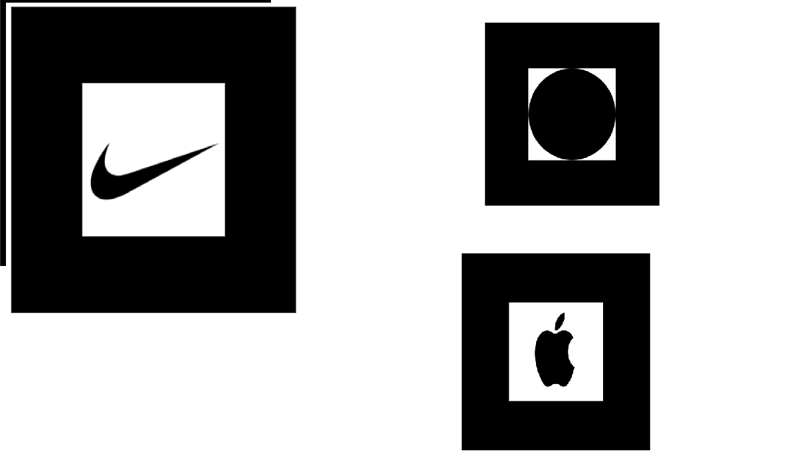
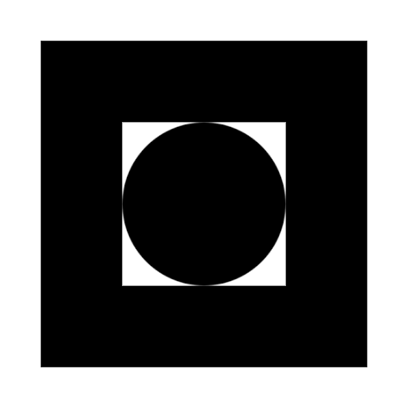

# AR Memory Game

An interactive Augmented Reality (AR) memory game built with **A-Frame** and **AR.js**, featuring 3D animations, particle effects, dynamic lighting, and real-time hand gesture recognition using **MediaPipe Hands**.

## Source code
Repository: https://github.com/adbista/webar-markers-demo

---

## Project overview
The player watches a sequence of activations of colored spheres displayed above AR markers, and then must reproduce the sequence in the same order.  
An activation means: the sphere jumps, a yellow dot appears on it, and a sound is played. During gameplay, random audio-visual challenges may appear that require performing a specific hand gesture to distract the player and test reflexes.

---

## Core gameplay rules
- The game shows a sequence — spheres/markers light up one by one and play animations.
- Your goal is to memorize the sequence and reproduce it in the same order.
- After a correct sequence, the level increases and the sequence becomes longer by one element.
- At a random moment, a gesture challenge (audio + visual prompt) may appear to intentionally distract you.
- One mistake in the sequence or a failed gesture challenge ends the game (**game over**).

---

## Step-by-step instructions
1. Use the marker set from `example.png` (or print/use `marker1.png`, `marker2.png`, `marker3.png` separately).
2. Run the game (online or locally).
3. Allow camera access.
4. Point the camera so that **all 3 markers are visible at the same time** — **this starts the game** (all three must be visible).
5. Watch the sequence of sphere highlights/animations.
6. Reproduce the sequence using the buttons and/or AR interaction.
7. When a gesture challenge appears, show the required gesture within the time limit.
8. The game continues until you make a mistake.

---

## Marker colors
- **Red sphere**
- **Green sphere**
- **Blue sphere**

---

## Required markers (print/use)
The required marker set is included in **`example.png`** (download/print it).  
Optionally, you can use separate files: **`marker1.png`**, **`marker2.png`**, **`marker3.png`**.

### Marker set (`example.png`)


### Separate markers
<p float="left">
  
  
  
</p>

---

## Hand gesture challenge system
During gameplay, random audio-visual challenges may appear that require a fast reaction and a correct hand gesture.  
Additionally, showing an **open palm** allows you to **retry once** when reproducing the sequence.

### Challenge mechanics
- An audio cue plays and a visual hint of the required gesture is shown.
- A **15-second countdown** starts.
- No correct gesture in time (or incorrect recognition) results in **game over**.

### Detected gestures
- **Thumbs up**
- **Peace sign (V)**

---

## How to run

### Method 0: Online (easiest)
Open: https://adbista.github.io/webar-markers-demo/

### Method 1: Local (recommended for dev) — local server
First, clone the repository:
```bash
git clone https://github.com/adbista/webar-markers-demo
cd webar-markers-demo
````

Then start a server:

```bash
# Python 3
python -m http.server 8000

# Node.js
npx http-server -p 8000
```

Open:

* [http://localhost:8000](http://localhost:8000)

### Method 2: Visual Studio Code (Live Server)

First, clone the repository:

```bash
git clone https://github.com/adbista/webar-markers-demo
cd webar-markers-demo
```

Then:

1. Install the **Live Server** extension
2. Right-click `index.html`
3. Select **Open with Live Server**

---

## Requirements & recommendations

* A browser with **WebRTC** support + camera access (AR + gesture detection)
* Good lighting (improves marker tracking)
* **Recommended: Chrome + a tablet** (usually more stable tracking and more comfortable controls)

---

## Technologies used

### Main frameworks

* **A-Frame 1.6.0** — WebVR/AR framework
* **AR.js 3.4.5** — marker-based AR tracking
* **MediaPipe Hands** — hand/gesture recognition
* **Web Audio API** — sound synthesis

### A-Frame components

* `a-sphere` — main game objects
* `a-torus` — orbital rings
* `a-light` (point) — dynamic lighting
* `a-entity` + `particle-system` — particle effects
* `a-text` — 3D labels
* `a-marker` — AR marker tracking

---

## Advanced features

### 3D animations & visuals

* Rotating spheres with individual animation speeds
* `a-torus` rings orbiting around each sphere
* Dynamic point lighting synchronized with interactions
* Scale animations on interaction
* Celebration effects after completing a level

### Gesture recognition

* Real-time hand tracking via **MediaPipe Hands**
* **Detected gestures:** **thumbs up** and **peace (V)**
* Works independently of marker tracking (separate input pipeline)
* Status indicator showing the gesture system state

### Audio system

* Unique tones for colors (C–E–G scale)
* Challenge sounds (e.g., 880 Hz high tone)
* Success melody (C–E–G–C progression)
* Failure sounds
* Audio synthesized using **Web Audio API**

### Combo system

* Counts consecutive correct inputs
* Bonus multiplier for combos `> 5`
* Visual feedback (color/size changes)
* Resets after a wrong input

---

## Demo

demo-preview:
[https://github.com/user-attachments/assets/c220d6b9-1e68-4deb-b961-1c135c7553bc](https://github.com/user-attachments/assets/c220d6b9-1e68-4deb-b961-1c135c7553bc)

```
```
